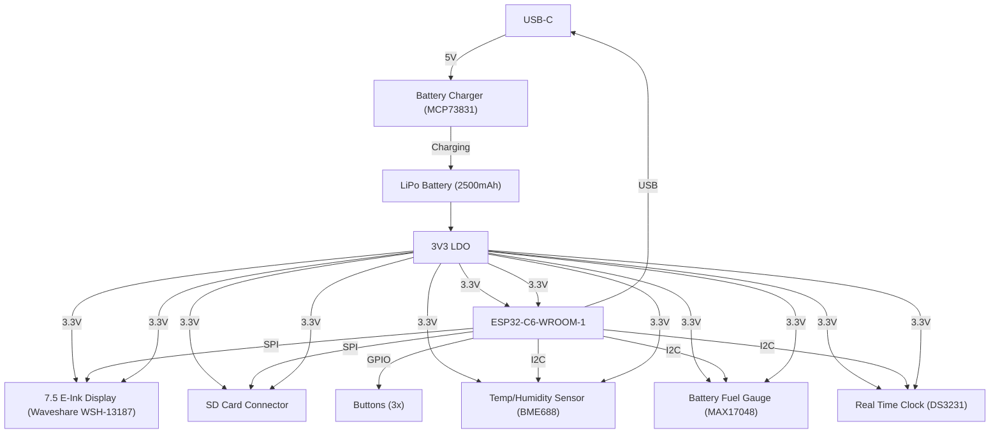

# Proiect TSC 2025 - OpenBook

## 1.O diagramă bloc cu toate componentele proiectului și cum sunt ele legate

## 2. BOM-ul (coloanele cu N/A sunt duplicate ale unui tip de componentă și am pus date doar la prima apariție a acelui tip de componentă)

Încă o observație, TP-ul si SJ-urile au fost modelate de către mine și astfel nu au model cu link sau data sheet.

| Name of component | Device                                       | Check Prices                                                                                                | DataSheet                                                                                                 |
|-------------------|----------------------------------------------|-----------------------------------------------------------------------------------------------------------------|---------------------------------------------------------------------------------------------------------------|
| BOOT_BUTTON       | BUTTON_CUSYOMV1                             | https://industry.panasonic.com/global/en/products/control/switch/light-touch/number/evqpuj02k                  | https://industry.panasonic.com/global/en/products/control/switch/light-touch/number/evqpuj02k                  |
| C1                | ESP32_WROVER_EAGLE-LTSPICE_CC0402            | https://industry.panasonic.com/global/en/products/control/switch/light-touch/number/evqpuj02k                  | https://industry.panasonic.com/global/en/products/control/switch/light-touch/number/evqpuj02k                  |
| C1_BAT            | ESP32_WROVER_EAGLE-LTSPICE_CC0402            | #N/A                                                                                                            | #N/A                                                                                                           |
| C1_BAT1           | EAGLE-LTSPICE_CC0402                         | #N/A                                                                                                            | #N/A                                                                                                           |
| C1_BAT2           | EAGLE-LTSPICE_CC0402                         | #N/A                                                                                                            | #N/A                                                                                                           |
| C2                | ESP32_WROVER_EAGLE-LTSPICE_CC0402            | #N/A                                                                                                            | #N/A                                                                                                           |
| C2_BAT\           | ESP32_WROVER_EAGLE-LTSPICE_CC0402            | #N/A                                                                                                            | #N/A                                                                                                           |
| C3                | RCL_CPOL-EUCT3528                            | #N/A                                                                                                            | #N/A                                                                                                           |
| C4                | ESP32_WROVER_EAGLE-LTSPICE_CC0402            | #N/A                                                                                                            | #N/A                                                                                                           |
| C4_USB            | ESP32_WROVER_EAGLE-LTSPICE_CC0402            | #N/A                                                                                                            | #N/A                                                                                                           |
| C5                | ESP32_WROVER_EAGLE-LTSPICE_CC0402            | #N/A                                                                                                            | #N/A                                                                                                           |
| C5_USB            | ESP32_WROVER_EAGLE-LTSPICE_CC0402            | #N/A                                                                                                            | #N/A                                                                                                           |
| C6                | ESP32_WROVER_EAGLE-LTSPICE_CC0402            | #N/A                                                                                                            | #N/A                                                                                                           |
| C7                | ESP32_WROVER_EAGLE-LTSPICE_CC0402            | #N/A                                                                                                            | #N/A                                                                                                           |
| C8                | ESP32_WROVER_EAGLE-LTSPICE_CC0402            | #N/A                                                                                                            | #N/A                                                                                                           |
| C9                | EAGLE-LTSPICE_CC0402                         | #N/A                                                                                                            | #N/A                                                                                                           |
| C10               | ESP32_WROVER_EAGLE-LTSPICE_CC0402            | #N/A                                                                                                            | #N/A                                                                                                           |
| C10_SUPERCAP      | CPH3225A                                     | https://www.snapeda.com/parts/CPH3225A/Seiko+Instruments/view-part/?ref=eda                                   | https://www.snapeda.com/parts/CPH3225A/Seiko+Instruments/view-part/?ref=eda                                   |
| CHANGE_BUTTON     | BUTTON_CUSYOMV1                             | https://industry.panasonic.com/global/en/products/control/switch-light-touch/number/evqpuj02k                  | https://industry.panasonic.com/global/en/products/control/switch-light-touch/number/evqpuj02k                  |
| CHG_LED           | ADAFRUIT_LEDCHIP-LED0603                     | https://www.snapeda.com/parts/KP-1608SURCK/Kingbright/view-part/?ref=search&t=LED%200603                       | https://www.snapeda.com/parts/KP-1608SURCK/Kingbright/view-part/?ref=search&t=LED%200603                       |
| C_DELAY           | ESP32_WROVER_EAGLE-LTSPICE_CC0402            | #N/A                                                                                                            | #N/A                                                                                                           |
| D1                | USBLC6-2SC6Y                                 | https://www.snapeda.com/parts/USBLC6-2SC6Y/STMicroelectronics/view-part/?ref=eda                              | https://www.snapeda.com/parts/USBLC6-2SC6Y/STMicroelectronics/view-part/?ref=eda                              |
| D2                | ESP32_WROVER_AVX---SD0805S020S1R0_AVX_...    | https://eu.mouser.com/ProductDetail/KYOCERA-AVX/SD0805S020S1R0?qs=jCA%252BPfw4LHbpkAoSnwrdjw%3D%3D              | http://datasheets.avx.com/schottky.pdf                                                                         |
| D3                | MBR0530                                      | https://eu.mouser.com/ProductDetail/KYOCERA-AVX/SD0805S020S1R0?qs=jCA%252BPfw4LHbpkAoSnwrdjw%3D%3D              | https://eu.mouser.com/ProductDetail/KYOCERA-AVX/SD0805S020S1R0?qs=jCA%252BPfw4LHbpkAoSnwrdjw%3D%3D              |
| D4                | MBR0530                                      | https://www.snapeda.com/parts/MBR0530/Onsemi/view-part/?ref=eda                                                | https://www.snapeda.com/parts/MBR0530/Onsemi/view-part/?ref=eda                                                |
| D5                | MBR0530                                      | https://www.snapeda.com/parts/MBR0530/Onsemi/view-part/?ref=eda                                                | https://www.snapeda.com/parts/MBR0530/Onsemi/view-part/?ref=eda                                                |
| D6                | PGB1010603MR                                 | https://www.snapeda.com/parts/PGB1010603MR/Littelfuse/view-part/?ref=eda                                      | https://www.snapeda.com/parts/PGB1010603MR/Littelfuse/view-part/?ref=eda                                      |
| D7                | ESP32_WROVER_AVX---SD0805S020S1R0_AVX_...    | https://eu.mouser.com/ProductDetail/KYOCERA-AVX/SD0805S020S1R0?qs=jCA%252BPfw4LHbpkAoSnwrdjw%3D%3D              | http://datasheets.avx.com/schottky.pdf                                                                         |
| D8                | PGB1010603MR                                 | https://www.snapeda.com/parts/PGB1010603MR/Littelfuse/view-part/?ref=eda                                      | https://www.snapeda.com/parts/PGB1010603MR/Littelfuse/view-part/?ref=eda                                      |
| D9                | PGB1010603MR                                 | https://www.snapeda.com/parts/PGB1010603MR/Littelfuse/view-part/?ref=eda                                      | https://www.snapeda.com/parts/PGB1010603MR/Littelfuse/view-part/?ref=eda                                      |
| D10               | PGB1010603MR                                 | https://www.snapeda.com/parts/PGB1010603MR/Littelfuse/view-part/?ref=eda                                      | https://www.snapeda.com/parts/PGB1010603MR/Littelfuse/view-part/?ref=eda                                      |
| D11               | PGB1010603MR                                 | https://www.snapeda.com/parts/PGB1010603MR/Littelfuse/view-part/?ref=eda                                      | https://www.snapeda.com/parts/PGB1010603MR/Littelfuse/view-part/?ref=eda                                      |
| D12               | PGB1010603MR                                 | https://www.snapeda.com/parts/PGB1010603MR/Littelfuse/view-part/?ref=eda                                      | https://www.snapeda.com/parts/PGB1010603MR/Littelfuse/view-part/?ref=eda                                      |
| EPD_C1            | ESP32_WROVER_EAGLE-LTSPICE_CC0402            | #N/A                                                                                                            | #N/A                                                                                                           |
| EPD_C2            | ESP32_WROVER_EAGLE-LTSPICE_CC0402            | #N/A                                                                                                            | #N/A                                                                                                           |
| EPD_C5            | ESP32_WROVER_EAGLE-LTSPICE_CC0402            | #N/A                                                                                                            | #N/A                                                                                                           |
| EPD_C6            | ESP32_WROVER_EAGLE-LTSPICE_CC0402            | #N/A                                                                                                            | #N/A                                                                                                           |
| EPD_C7            | ESP32_WROVER_EAGLE-LTSPICE_CC0402            | #N/A                                                                                                            | #N/A                                                                                                           |
| EPD_C8            | ESP32_WROVER_EAGLE-LTSPICE_CC0402            | #N/A                                                                                                            | #N/A                                                                                                           |
| EPD_C9            | ESP32_WROVER_EAGLE-LTSPICE_CC0402            | #N/A                                                                                                            | #N/A                                                                                                           |
| EPD_C10           | ESP32_WROVER_EAGLE-LTSPICE_CC0402            | #N/A                                                                                                            | #N/A                                                                                                           |
| EPD_C11           | ESP32_WROVER_EAGLE-LTSPICE_CC0402            | #N/A                                                                                                            | #N/A                                                                                                           |
| EPD_C12           | ESP32_WROVER_EAGLE-LTSPICE_CC0402            | #N/A                                                                                                            | #N/A                                                                                                           |
| IC1               | BD5229G-TR                                   | https://componentsearchengine.com/part-view/BD5229G-TR/ROHM%20Semiconductor                                    | https://componentsearchengine.com/part-view/BD5229G-TR/ROHM%20Semiconductor                                    |
| IC4               | XC6220A331MR-G                               | https://componentsearchengine.com/part-view/XC6220A331MR-G/Torex                                              | https://componentsearchengine.com/part-view/XC6220A331MR-G/Torex                                              |
| J1                | FH34SRJ-24S-0.5SH_99_                        | https://componentsearchengine.com/part-view/XC6220A331MR-G/Torex                                              | https://componentsearchengine.com/part-view/XC6220A331MR-G/Torex                                              |
| J2                | SAMACSYS_PARTS_USB4110-GF-A                  | https://componentsearchengine.com/part-view/USB4110-GF-A/GCT%20(GLOBAL%20CONNECTOR%20TECHNOLOGY               | https://componentsearchengine.com/part-view/USB4110-GF-A/GCT%20(GLOBAL%20CONNECTOR%20TECHNOLOGY               |
| J3                | QWIIC_CONNECTORJS-1MM                        | #N/A                                                                                                            | #N/A                                                                                                           |
| J4                | 112A-TAAR-R03_ATTEND                         | https://store.comet.srl.ro/Catalogue/Product/43497/                                                            | https://store.comet.srl.ro/Catalogue/Product/43497/                                                            |
| L1                | 744043680IND_4828-WE-TPC_WRE                 | https://eu.mouser.com/ProductDetail/Wurth-Elektronik/744043680?qs=PGXP4M47uW6VkZq%252BkzjrHA%3D%3D               | https://eu.mouser.com/ProductDetail/Wurth-Elektronik/744043680?qs=PGXP4M47uW6VkZq%252BkzjrHA%3D%3D               |
| PFMF.050.1        | ESP32C6_VARISTORCN1812                       | https://www.mouser.co.uk/ProductDetail/EPCOS-TDK/B72520T0350K062?qs=dEfas%2FXlABIszF52uu7vrg%3D%3D              | https://www.mouser.co.uk/ProductDetail/EPCOS-TDK/B72520T0350K062?qs=dEfas%2FXlABIszF52uu7vrg%3D%3D              |
| Q1                | ESP32_WROVER_SPARKFUN-DISCRETESEMI_MOSFET_...| https://componentsearchengine.com/part-view/DMG2305UX-7/Diodes%20Incorporated                                  | https://componentsearchengine.com/part-view/DMG2305UX-7/Diodes%20Incorporated                                  |
| Q2                | ESP32_WROVER_SPARKFUN-DISCRETESEMI_MOSFET_...| #N/A                                                                                                            | #N/A                                                                                                           |
| Q3                | D8                                           | https://componentsearchengine.com/part-view/SI1308EDL-T1-GE3/Vishay                                           | https://componentsearchengine.com/part-view/SI1308EDL-T1-GE3/Vishay                                           |
| R1                | ESP32_WROVER_EAGLE-LTSPICE_RR0402            | #N/A                                                                                                            | #N/A                                                                                                           |
| R1-PINH           | ESP32_WROVER_EAGLE-LTSPICE_RR0402            | #N/A                                                                                                            | #N/A                                                                                                           |
| R1-PINH1          | ESP32_WROVER_EAGLE-LTSPICE_RR0402            | #N/A                                                                                                            | #N/A                                                                                                           |
| R1_BAT            | ESP32_WROVER_EAGLE-LTSPICE_RR0402            | #N/A                                                                                                            | #N/A                                                                                                           |
| R1_PWRUSB         | ESP32_WROVER_EAGLE-LTSPICE_RR0402            | #N/A                                                                                                            | #N/A                                                                                                           |
| R2                | ESP32_WROVER_EAGLE-LTSPICE_RR0402            | https://componentsearchengine.com/part-view/R0402%201%25%20100%20K%20(RC0402FR-07100KL                         | https://componentsearchengine.com/part-view/R0402%201%25%20100%20K%20(RC0402FR-07100KL                         |
| R2-PINH           | ESP32_WROVER_EAGLE-LTSPICE_RR0402            | #N/A                                                                                                            | #N/A                                                                                                           |
| R2-PINH1          | ESP32_WROVER_EAGLE-LTSPICE_RR0402            | #N/A                                                                                                            | #N/A                                                                                                           |
| R2-USB            | ESP32_WROVER_EAGLE-LTSPICE_RR0402            | #N/A                                                                                                            | #N/A                                                                                                           |
| R2-USB1           | ESP32_WROVER_EAGLE-LTSPICE_RR0402            | #N/A                                                                                                            | #N/A                                                                                                           |
| R2_BAT            | ESP32_WROVER_EAGLE-LTSPICE_RR0402            | #N/A                                                                                                            | #N/A                                                                                                           |
| R3                | ESP32_WROVER_EAGLE-LTSPICE_RR0402            | #N/A                                                                                                            | #N/A                                                                                                           |
| R4                | ESP32_WROVER_EAGLE-LTSPICE_RR0402            | #N/A                                                                                                            | #N/A                                                                                                           |
| R5                | ESP32_WROVER_EAGLE-LTSPICE_RR0402            | #N/A                                                                                                            | #N/A                                                                                                           |
| R6                | ESP32_WROVER_EAGLE-LTSPICE_RR0402            | #N/A                                                                                                            | #N/A                                                                                                           |
| R7                | ESP32_WROVER_EAGLE-LTSPICE_RR0402            | #N/A                                                                                                            | #N/A                                                                                                           |
| R8                | ESP32_WROVER_EAGLE-LTSPICE_RR0402            | #N/A                                                                                                            | #N/A                                                                                                           |
| R9                | ESP32_WROVER_EAGLE-LTSPICE_RR0402            | #N/A                                                                                                            | #N/A                                                                                                           |
| R10               | ESP32_WROVER_EAGLE-LTSPICE_RR0402            | #N/A                                                                                                            | #N/A                                                                                                           |
| RESET_BUTTON      | BUTTON_CUSYOMV1                             | https://industry.panasonic.com/global/en/products/control/switch/light-touch/number/evqpuj02k                  | https://industry.panasonic.com/global/en/products/control/switch/light-touch/number/evqpuj02k                  |
| R_BOOT            | ESP32_WROVER_EAGLE-LTSPICE_RR0402            | #N/A                                                                                                            | #N/A                                                                                                           |
| R_CAPACITOR       | ESP32_WROVER_EAGLE-LTSPICE_RR0402            | #N/A                                                                                                            | #N/A                                                                                                           |
| R_CHANGE          | ESP32_WROVER_EAGLE-LTSPICE_RR0402            | #N/A                                                                                                            | #N/A                                                                                                           |
| R_CL1             | ESP32_WROVER_EAGLE-LTSPICE_RR0402            | #N/A                                                                                                            | #N/A                                                                                                           |
| R_RESET           | ESP32_WROVER_EAGLE-LTSPICE_RR0402            | #N/A                                                                                                            | #N/A                                                                                                           |
| SENSOR2           | ESP32_WROVER_BME680_BME680                   | https://www.snapeda.com/parts/BME680/Bosch/view-part/?welcome=home                                            | https://www.snapeda.com/parts/BME680/Bosch/view-part/?welcome=home                                            |
| SJ1              | SJ                                           | https://grabcad.com/library/solder-jumpers-1                                                                   | https://grabcad.com/library/solder-jumpers-1                                                                   |
| TP1               | TPTP20R                                      | #N/A                                                                                                            | #N/A                                                                                                           |
| TP2               | TPTP20R                                      | #N/A                                                                                                            | #N/A                                                                                                           |
| TP3               | TPTP20R                                      | #N/A                                                                                                            | #N/A                                                                                                           |
| TP4               | TPTP20R                                      | #N/A                                                                                                            | #N/A                                                                                                           |
| TP5               | TPTP20R                                      | #N/A                                                                                                            | #N/A                                                                                                           |
| TP6               | TPTP20R                                      | #N/A                                                                                                            | #N/A                                                                                                           |
| TP7               | TPTP20R                                      | #N/A                                                                                                            | #N/A                                                                                                           |
| TP8               | TPTP20R                                      | #N/A                                                                                                            | #N/A                                                                                                           |
| TP9               | TPTP20R                                      | #N/A                                                                                                            | #N/A                                                                                                           |
| TP10              | TPTP20R                                      | #N/A                                                                                                            | #N/A                                                                                                           |
| TP11              | TPTP20R                                      | #N/A                                                                                                            | #N/A                                                                                                           |
| TP12              | TPTP20R                                      | #N/A                                                                                                            | #N/A                                                                                                           |
| TP13              | TPTP20R                                      | #N/A                                                                                                            | #N/A                                                                                                           |
| TP14              | TPTP20R                                      | #N/A                                                                                                            | #N/A                                                                                                           |
| TP15              | TPTP20R                                      | #N/A                                                                                                            | #N/A                                                                                                           |
| TP16              | TPTP20R                                      | #N/A                                                                                                            | #N/A                                                                                                           |
| TP17              | TPTP20R                                      | #N/A                                                                                                            | #N/A                                                                                                           |
| U1                | W25Q512JVEIQ                                 | https://www.snapeda.com/parts/W25Q512JVEIQ/Winbond+Electronics/view-part/?ref=eda                             | https://www.snapeda.com/parts/W25Q512JVEIQ/Winbond+Electronics/view-part/?ref=eda                             |
| U2                | ESP32-C6-WROOM-1-N8                          | https://www.snapeda.com/parts/ESP32-C6-WROOM-1-N8/Espressif+Systems/view-part/?ref=eda                        | https://www.snapeda.com/parts/ESP32-C6-WROOM-1-N8/Espressif+Systems/view-part/?ref=eda                        |
| U3                | DS3231SN#                                    | https://www.snapeda.com/parts/DS3231SN%23/Analog+Devices/view-part/?ref=eda                                   | https://www.snapeda.com/parts/DS3231SN%23/Analog+Devices/view-part/?ref=eda                                   |
| U4                | MAX17048G+T10                                | https://www.snapeda.com/parts/MAX17048G+T10/Analog+Devices/view-part/?ref=eda                                 | https://www.snapeda.com/parts/MAX17048G+T10/Analog+Devices/view-part/?ref=eda                                 |
| U5                | ESP32_WROVER_SPARKFUN-IC-POWER_MCP73831      | https://eu.mouser.com/ProductDetail/Microchip-Technology/MCP73831T-2ACI-OT?qs=yUQqVecv4qvbBQBGbHx0Mw%3D%3Dcf   | https://eu.mouser.com/ProductDetail/Microchip-Technology/MCP73831T-2ACI-OT?qs=yUQqVecv4qvbBQBGbHx0Mw%3D%3Dcf   |

## 3. Descrierea in detaliu a functionalitatilor hardware 

### 1. Microcontroller – ESP32-C6

- **Procesor**: 32-bit RISC-V, cu frecvență de până la 160MHz.
    
- **Memorie**: 512KB SRAM intern și 8MB flash extern (W25Q512JVEIQ).
    
- **Conectivitate**: Wi-Fi 6 (802.11ax), Bluetooth 5 (LE), USB 2.0 (full-speed).
    
- **Periferice**: SPI, I²C, UART, GPIO multiple.
    
- **Consum**: Posibilitate de moduri low-power (sleep, deep sleep).
---

### 2. Afișajul E-Paper (7.5 inch)

- **Model**: Waveshare (sau echivalent) cu rezoluție 800×480.
    
- **Interfață**: 4-wire SPI + semnale de control (CS, DC, RST, BUSY).
    
- **Consum**: Foarte redus în mod static (după refresh), dar necesită un curent mai mare în timpul refresh-ului (aprox. 15–25mA, în funcție de modul de actualizare).
    

**De ce l-am ales?**  
E-paper consumă energie doar când reîmprospătează imaginea. Este ideal pentru un e-reader, deoarece menține afișajul vizibil fără consum suplimentar.

---

### 3. Senzor de Mediu – BME688

- **Parametri măsurați**: Temperatură, Umiditate, Presiune și Calitate aer (VOC/eCO2).
    
- **Interfață**: I²C la 400kHz (SDA și SCL).
    
- **Consum**: Foarte mic (în jur de 2.1µA în standby și până la câteva mA în mod de măsurare).
    

**De ce BME688?**  
Integrează într-un singur cip mai multe tipuri de măsurători de mediu, util pentru a afișa date despre condițiile de citire (temperatură, umiditate etc.).

---

### 4. Baterie și Managementul Energiei

- **Baterie Li-Po 2500mAh** (3.7V nominal).
    
- **IC de Încărcare**: MCP73831 (Microchip) – încărcare Li-Po prin USB-C (până la 1A).
    
- **Fuel Gauge**: MAX17048 – monitorizează nivelul de încărcare, tensiunea și starea bateriei (I²C).
    
- **LDO**: XC6220A331MR-G (exemplu) sau echivalent, pentru a asigura 3.3V stabil pentru microcontroller și restul componentelor.
    

**De ce aceste componente?**

- MCP73831 este un controler simplu, fiabil și compatibil cu USB.
    
- MAX17048 oferă date precise despre nivelul bateriei și poate alerta asupra unei baterii descărcate.
    

---

### 5. Butoane (3x Tactile Switch)

- **Tip**: Tactile switch Panasonic (sau echivalent).
    
- **Funcții**: Navigare meniu, selectare opțiune, întoarcere pagină etc.
    
- **Conexiune**: Fiecare buton se leagă la un GPIO al ESP32-C6 printr-un circuit de debouncing (rezistență și condensator) sau se poate face debouncing în firmware.
    

---

### 6. USB-C Port

- **Rol**: Încărcare baterie + Transfer de date (USB 2.0 full-speed).
    
- **Protecții**: ESD (USBLC6-2SC6Y) + rezistențe de terminare.
    
- **Posibilitate**: Actualizări firmware prin USB (bootloader + tool extern) sau direct OTA prin Wi-Fi.
    

---

### 7. Conector Qwiic (I²C)

- Conector standard cu 4 pini: VCC, GND, SDA, SCL.
    
- Permite atașarea rapidă a altor senzori sau module I²C (expansiune, testare, prototipare rapidă).
    

---

### 8. SD Memory Card Connector (112A-TAAR-R03)

- **Rol**: Posibilitate de stocare externă pentru e-book-uri, log-uri sau update-uri firmware.
    
- **Interfață**: Poate fi SD (1-bit / 4-bit) sau SPI, în funcție de configurația firmware-ului.
    

---

### 9. RTC – DS3231

- **Funcție**: Asigură un ceas de timp real foarte precis.
    
- **Interfață**: I²C (aceeași magistrală cu BME688 și MAX17048).
    
- **Backup**: Supercondensator sau baterie secundară pentru a menține timpul și în absența alimentării principale.
    

---

### 10. Memorii Suplimentare

- **W25Q512JVEIQ** (Flash extern) – conectat la ESP32-C6 prin SPI dedicat (quad SPI).
    
    - Aici se stochează firmware-ul și datele mari (e-book-uri etc.).
        

---

### Comunicarea și Interfețele

1. **SPI**:
    
    - Ecranul e-paper (4-wire SPI).
        
    - Flash extern (quad SPI dedicat, pinii sunt în mare parte fixați de designul ESP32-C6).
        
2. **I²C**:
    
    - Senzorul BME688.
        
    - Fuel Gauge MAX17048.
        
    - RTC DS3231.
        
    - Qwiic Connector (pentru potențiale extensii).
        
3. **USB 2.0**:
    
    - Date + alimentare/încărcare prin USB-C.
        
4. **GPIO**:
    
    - Butoane (3x intrări digitale).
        
    - Eventual semnale de control suplimentare (reset display, busy pin display, semnal de enable alimentare etc.).
        

### Calcul Simplificat al Consumului

| Modul                     | Consum tipic                           |
| ------------------------- | -------------------------------------- |
| **ESP32-C6** (activ)      | ~80mA (Wi-Fi activ) / < 10mA (idle)    |
| **E-Paper** (refresh)     | ~15–25mA (doar în timpul refresh-ului) |
| **BME688** (activ)        | ~3.6mA (peak) / 2.1µA (sleep)          |
| **MAX17048** (fuel gauge) | ~50µA                                  |
| **DS3231** (RTC)          | ~3.5mA (activ) / <1µA (back-up)        |
| **MCP73831** (charger)    | Depinde de curentul de încărcare       |

În Deep Sleep (când e-reader-ul nu face nimic și are doar RTC și fuel gauge active), consumul total se poate reduce sub 50–100µA (principalul consumator rămânând RTC și circuitele de monitorizare).
În Active + Wi-Fi (descărcare de e-book, refresh ecran etc.), consumul poate ajunge la 100–150mA.

Cu o baterie de 2500mAh, în regim normal de utilizare (majoritatea timpului e inactiv, doar afișează static), se poate atinge o autonomie de câteva săptămâni, în funcție de frecvența refresh-urilor ecranului și a conectărilor Wi-Fi.

## 4. Descrieți în detaliu ce pini ai ESP32-C6 sunt folosiți pentru fiecare componentă și de ce

| Pin ESP32-C6    | Componentă / Semnal                       | De ce?                                                        |
| --------------- | ----------------------------------------- | ------------------------------------------------------------- |
| **GPIO1 (SDA)** | I²C SDA (BME688, MAX17048, DS3231, Qwiic) | Partajare magistrală I²C pentru toți senzorii și RTC.         |
| **GPIO2 (SCL)** | I²C SCL (BME688, MAX17048, DS3231, Qwiic) | Linia de clock pentru I²C.                                    |
| **GPIO5**       | SPI MISO (E-Paper)                        | Citirea datelor/statusului display-ului (dacă e suportat).    |
| **GPIO6**       | SPI MOSI (E-Paper)                        | Trimiterea datelor către e-paper.                             |
| **GPIO7**       | SPI CLK (E-Paper)                         | Semnal de clock pentru e-paper.                               |
| **GPIO8**       | SPI CS (E-Paper)                          | Chip Select pentru e-paper.                                   |
| **GPIO9**       | E-Paper DC (Data/Command)                 | Semnal care diferențiază datele de comenzile pentru afișaj.   |
| **GPIO10**      | E-Paper RST                               | Reset hardware pentru e-paper.                                |
| **GPIO11**      | E-Paper BUSY                              | Intrare din display, indică dacă este ocupat.                 |
| **GPIO12**      | Button #1                                 | Intrare digitală pentru buton (ex. NEXT page).                |
| **GPIO13**      | Button #2                                 | Intrare digitală pentru buton (ex. PREV page).                |
| **GPIO14**      | Button #3                                 | Intrare digitală pentru buton (ex. MENU/OK).                  |
| **GPIO15**      | MAX17048 ALERT (opțional)                 | Avertizare nivel baterie scăzut.                              |
| **GPIO16**      | USB D+ (intern la USB PHY)                | Pin dedicat pentru USB 2.0. (În mod normal pin hardware fix). |
| **GPIO17**      | USB D- (intern la USB PHY)                | Pin dedicat pentru USB 2.0. (La fel, pin fix).                |
| **GPIO18**      | LED de status (opțional)                  | Indicator pentru diverse stări (Wi-Fi, încărcare, etc.).      |
| **GPIO19**      | SD Card CS (opțional)                     | Chip Select pentru cardul SD (dacă se folosește SPI).         |
| **GPIO20**      | SD Card MISO (opțional)                   | Intrare date de la card SD.                                   |
| **GPIO21**      | SD Card MOSI (opțional)                   | Ieșire date către card SD.                                    |
| **GPIO4**       | SD Card CLK (opțional)                    | Semnal de clock pentru card SD (SPI).                         |

## Orice altceva 

Design log-ul poate fi gasit pe [autodesk](https://a360.co/4kX1RTV)

A fost un proiect foarte solicitant :))
